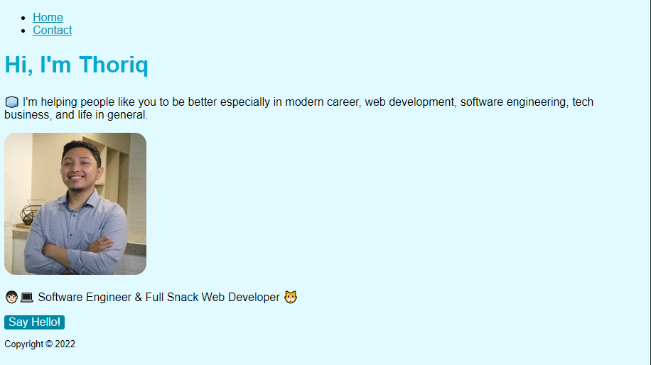

# WEEKLY ASSIGNMENT 1

Greetings World, for this week assignment we (Revou FSSE Students) are tasked with making a simple website that requires **HTML**, **CSS**, and also **Java Script**

The task required a few skillset such as:
- Website Repository
- Website Structure with HTML
- Website Simple Deployment
- Website Interaction with JavaScript

From what I can gather these are the key features that needs to be on the website:
1. Website Slicing with HTML
2. Inserting a Picture
3. Styling with CSS (_font, font color, background color_)
4. Simple Interaction with JS

The preview of the example website is shown as below

Meanwhile this is the link to my results
[Click Me!](https://rayhanzou-week1-assignment.netlify.app)
